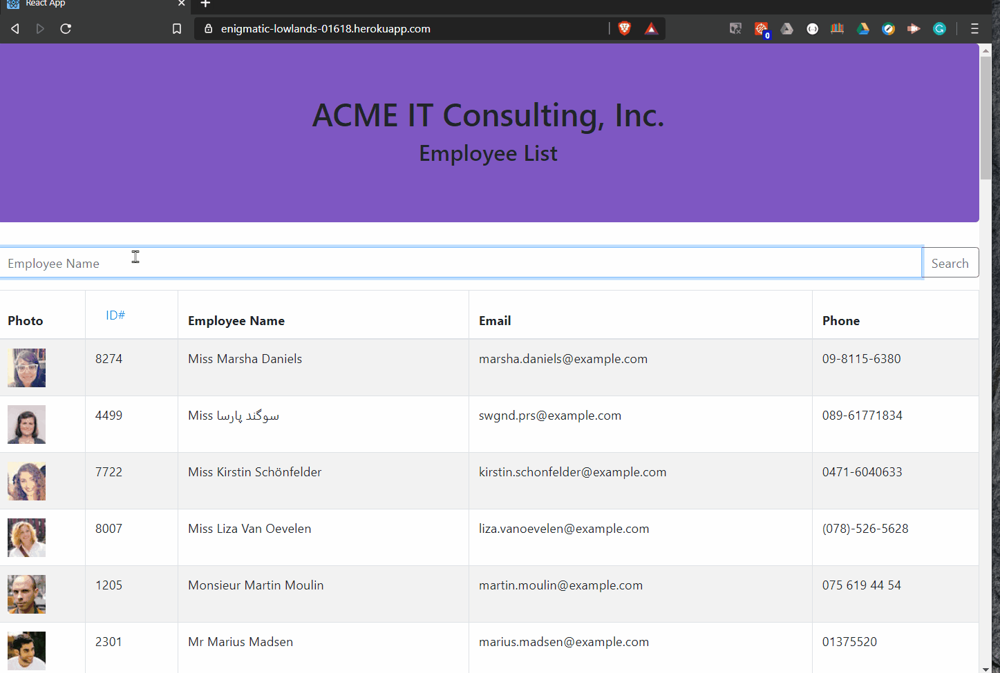

# Employee Directory App

## Description
This is a simple react application that allows a user to filter and sort an employee directory.

## Deployment
[Employee Directory](https://enigmatic-lowlands-01618.herokuapp.com/)

## Badges

## Questions
If you have any questions about the repo, open an issue or contact [Hlsorrells](github.com/Hlsorrells) directly at [hlsorrells.dev@gmail.com](mailto:hlsorrells.dev@gmail.com).

## Author
[Heather Sorrells](mailto:hlsorrells.dev@gmail.com)

## Contributing
Go to GitHub repo and create a pull request or email the developer directly. See [Questions](#questions).
